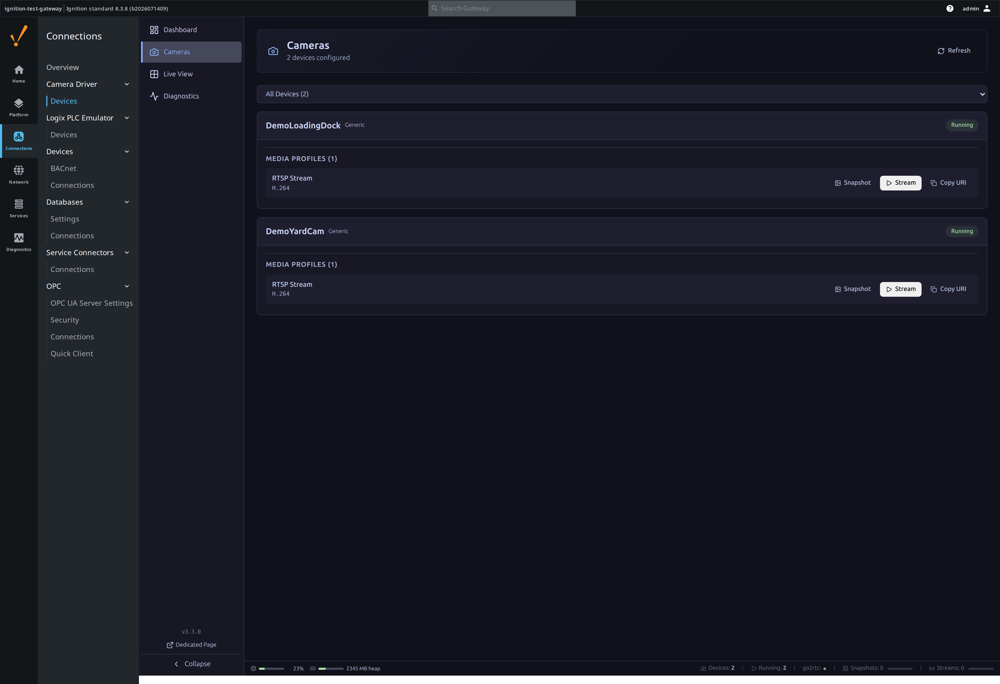
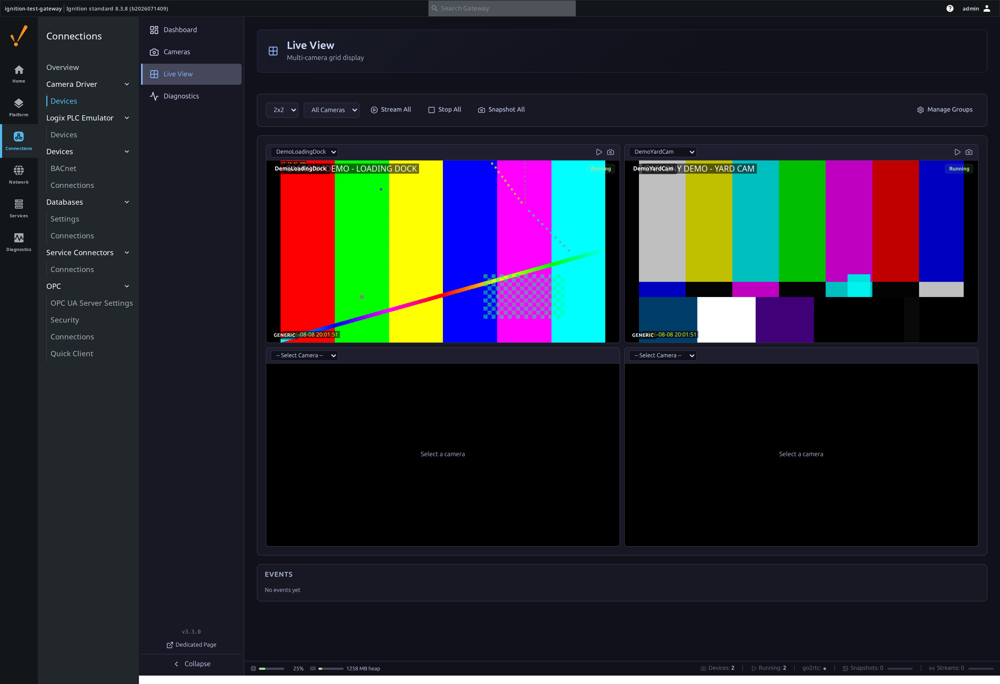
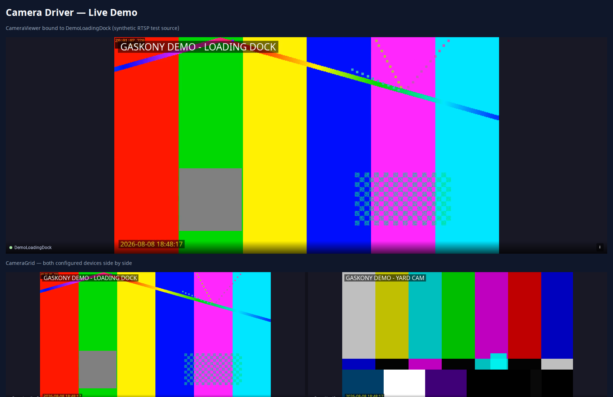
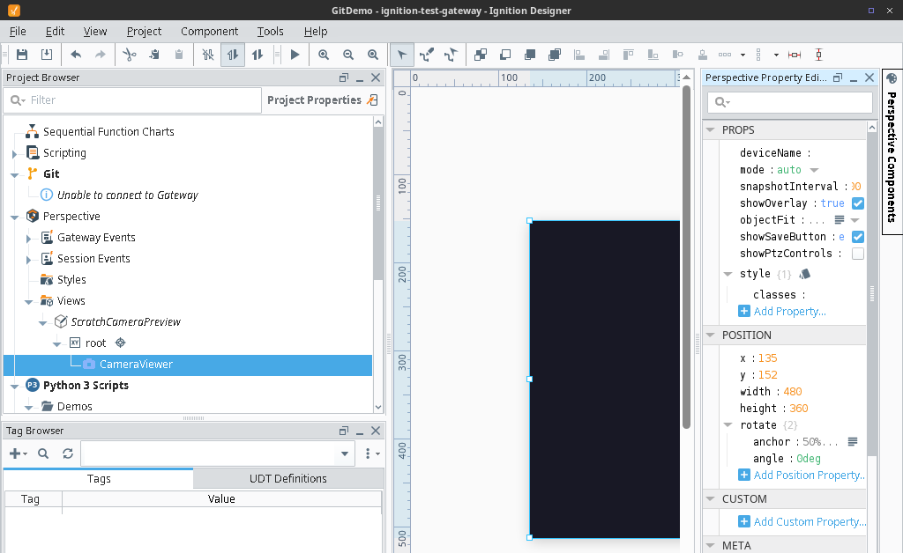

# Ignition Camera Driver Module

A single unified **Camera** device type for Ignition 8.3 that brings live video, PTZ control, and camera health straight into the platform — no separate VMS window, no vendor lock-in.

## Why this exists

SCADA is supervisory control and data acquisition — and in today's world, no
matter where SCADA is used, cameras are a key insight into what is going on.
Yet camera video traditionally lives in a separate VMS window, disconnected
from the SCADA screens operators actually watch. **This module makes any
commodity IP camera a first-class Ignition device**: live video and PTZ
control on the same Perspective page as the process data it relates to, and
camera health, status, and capabilities as OPC-UA tags that alarm and
historise like any other device. Standard protocols only (ONVIF, RTSP, MJPEG,
snapshot URLs) — no vendor lock-in, no cloud, no separate VMS licence.

The full purpose, definition of done, and permanent won't-do list live in
[docs/PROJECT_CHARTER.md](docs/PROJECT_CHARTER.md) — the charter drives every
release decision.

## What it looks like

Every camera pictured below is a synthetic RTSP test source stood up for this
README (see *How to use it*) — `DemoLoadingDock` and `DemoYardCam`. No physical
camera is required to reproduce any of it.

**Camera device detail** — the Connection Browser's device list, expanded. It
shows exactly what the module discovers per device: `DemoLoadingDock`'s and
`DemoYardCam`'s RTSP media profiles (H.264), each with Snapshot/Stream/Copy
URI actions. (ONVIF discovery — manufacturer/model/firmware/serial and
multi-profile enumeration — is a real capability of the module against ONVIF
hardware; it isn't pictured here because it needs physical ONVIF hardware to
demonstrate honestly.)



**Gateway Live View grid** — the Connection Browser's built-in multi-camera
grid, actually streaming: the left tile is `DemoLoadingDock`'s synthetic feed
(colour bars, a moving marker, and a live timestamp overlay proving it isn't
a static image); the right tile is `DemoYardCam`, a second synthetic source
with a visibly different test pattern (SMPTE bars) so the two tiles are
clearly distinct.



**Perspective `CameraViewer` and `CameraGrid` components** — the same video,
now embedded in a Perspective page next to whatever process data it belongs
with. The top pane is a single `CameraViewer` bound to `DemoLoadingDock`; the
bottom pane is a `CameraGrid` showing both synthetic devices side by side,
proving the grid component streams multiple devices at once.



**Designer-scope authoring** — `CameraViewer` and `CameraGrid` are ordinary
Perspective components in the Designer's own component palette (Camera Driver
category), draggable onto any view. The property editor shown here is a
`CameraViewer` dropped on a scratch view, exposing its real bindable
properties — `deviceName`, `mode`, `snapshotInterval`, `showOverlay`,
`objectFit`, `showSaveButton`, `showPtzControls` — the same as any built-in
component, with no special-casing needed to use them.



## What it does

| Method | Protocol | Capabilities |
| -------- | ---------- | ------------- |
| **RTSP** | RTSP | Direct video streaming, browser playback via bundled go2rtc + ffmpeg |
| **MJPEG** | HTTP MJPEG | Direct MJPEG video streaming |
| **Snapshot** | HTTP | JPEG snapshot capture from a still-image URL |
| **ONVIF** | ONVIF SOAP | Device discovery, media profile enumeration, PTZ control, and auto-detection of stream/snapshot URLs (Profile S/T) |

A single Camera device can use any combination of the above, enabled per
device. URLs for RTSP, MJPEG, and snapshot can be entered directly or
auto-detected via ONVIF when enabled.

- Single unified **Camera** device type with per-device connection methods
- Multi-protocol camera connectivity (RTSP, MJPEG, snapshot URLs, ONVIF)
- **Sub-second live video via WebRTC** (v3.1.0+), with automatic MSE → snapshot fallback
- PTZ control from Perspective and the gateway Connection Browser
- Authenticated HTTP endpoints (session auth, Basic Auth, API key, Perspective session tokens)
- Per-IP rate limiting (DoS protection)
- Bundled go2rtc and ffmpeg for RTSP-to-browser streaming — no external media server
- Hierarchical OPC-UA address space with camera data
- Connection Browser UI in Gateway Config (dashboard, live grid, diagnostics)
- Perspective `CameraViewer` and `CameraGrid` components
- Configurable SSL/TLS validation modes
- 550+ automated tests with 100% pass rate (gateway/common JUnit + web-ui vitest)

## How to use it

### 1. Install

Gateway web UI → **Config → System → Modules → Install or Upgrade a Module** →
upload the signed `.modl`. No gateway restart is required — the module
hot-loads.

**WebRTC note:** the bundled go2rtc listens for WebRTC media on port **8555**
(TCP+UDP). Host-network deployments need nothing. Docker *bridge*-network
deployments must publish `-p 8555:8555 -p 8555:8555/udp` and list the
host-reachable IP in `data/camera-driver/go2rtc/webrtc-candidates.txt` (one
`host:port` per line). If WebRTC cannot connect, playback silently falls back
to MSE.

### 2. Configure a device

1. Gateway → Config → OPC UA → Device Connections
2. Create new Device → Select **"Camera"**
3. Enter the camera IP address, username, and password
4. Enable the connection methods the camera supports (RTSP, MJPEG, Snapshot, ONVIF)
5. For RTSP/MJPEG/snapshot, either enter URLs directly or enable ONVIF to auto-detect them
6. Save and view tags in OPC Browser, or open the Connection Browser
   (`/data/camera-driver/connection-browser`)

Don't have a camera handy? The screenshots above were captured against
synthetic RTSP sources — no hardware required to try the module:

```bash
# 1. RTSP test server. Use a port other than 8554 if the gateway itself is
#    host-networked — its own bundled go2rtc already owns 8554 on that host.
docker run -d --name mediamtx-demo --network host \
  -e MEDIAMTX_RTSPADDRESS=:8556 \
  bluenviron/mediamtx:latest

# 2. A looping synthetic camera feed (colour bars + moving marker + live timestamp)
ffmpeg -re -f lavfi -i "testsrc2=size=1280x720:rate=25" \
  -vf "drawtext=text='DEMO CAMERA':fontcolor=white:fontsize=32:x=20:y=20:box=1:boxcolor=black@0.55" \
  -c:v libx264 -preset veryfast -tune zerolatency -pix_fmt yuv420p \
  -f rtsp rtsp://127.0.0.1:8556/cam1

# 3. (optional) A second, visibly different feed — useful for trying CameraGrid
#    with more than one tile, exactly as in the grid screenshots above.
ffmpeg -re -f lavfi -i "smptebars=size=1280x720:rate=25" \
  -vf "drawtext=text='DEMO CAMERA 2':fontcolor=white:fontsize=32:x=20:y=20:box=1:boxcolor=black@0.55" \
  -c:v libx264 -preset veryfast -tune zerolatency -pix_fmt yuv420p \
  -f rtsp rtsp://127.0.0.1:8556/cam2
```

Then create a Camera device as above with RTSP enabled, Snapshot/MJPEG/ONVIF
disabled, and **RTSP URL Override** set to `rtsp://127.0.0.1:8556/cam1` (and,
for a second device, `rtsp://127.0.0.1:8556/cam2`).

### 3. Put it on a Perspective page

Drag a `CameraViewer` (single camera) or `CameraGrid` (multi-camera) component
onto a view and set `deviceName` (or `cameras: []` for the grid) to the device
name(s) created above. See **[docs/USAGE.md](docs/USAGE.md)** for the full
HTTP endpoint and component reference, and
**[docs/TESTING.md](docs/TESTING.md)** for complete testing instructions.

---

## Configuration Fields

All fields belong to the single **Camera** device type.

**General**: Device Name, Enabled

**Connection**: IP Address, Port, Username, Password, Use HTTPS, Connection Timeout, SSL Validation Mode

**Streams** (connection methods): RTSP Stream, MJPEG Stream, Snapshot, ONVIF / PTZ, plus optional RTSP URL / Snapshot URL / MJPEG URL overrides

**Advanced**: Poll Interval (ONVIF only)

## HTTP Endpoints

All endpoints are at `/data/camera-driver/*` and require authentication.

| Endpoint | Description |
| ---------- | ------------- |
| `/data/camera-driver/snapshot?device=X&profile=Y` | JPEG snapshot |
| `/data/camera-driver/stream?device=X&profile=Y&fps=Z` | Live stream (fMP4/MJPEG fallback chain) |
| `POST /data/camera-driver/webrtc?device=X` | WebRTC SDP signaling (offer in, answer out) |
| `POST /data/camera-driver/ptz/move?device=X&pan=&tilt=&zoom=` | PTZ continuous move (hold) |
| `POST /data/camera-driver/ptz/stop?device=X` | PTZ stop (release) |
| `/data/camera-driver/ptz/status?device=X` | Current PTZ position |
| `/data/camera-driver/devices` | List all devices |
| `/data/camera-driver/device/:name/status` | Device status |
| `/data/camera-driver/connection-browser` | Connection Browser UI |
| `/data/camera-driver/health` | Health check |
| `/data/camera-driver/metrics` | Per-camera resource metrics |

## Current Status

**Version**: 3.3.0 | **Status**: Production Ready

## Project Structure

```text
ignition-module-camera-driver/
├── build.gradle.kts              # Root build configuration
├── settings.gradle.kts           # Subprojects
├── common/                       # Shared code
├── designer/                     # Designer-side hook
├── gateway/                      # Gateway-side implementation
│   └── src/main/java/com/gaskony/camera/gateway/
│       ├── CameraModuleHook.java                   # Module entry point
│       ├── device/
│       │   ├── CameraExtensionPoint.java           # Unified "Camera" device type
│       │   ├── CameraDevice.java                   # Device lifecycle
│       │   ├── CameraConfig.java                   # Device configuration record
│       │   ├── LegacyCameraExtensionPoint.java     # Hidden pre-v3.0.0 alias (back-compat)
│       │   ├── ONVIFPoller.java                    # ONVIF polling mechanism
│       │   ├── AddressSpaceBuilder.java            # OPC-UA node builder
│       │   └── generic/                            # URL-based stream/snapshot helpers
│       ├── onvif/                                   # ONVIF protocol layer
│       │   ├── ONVIFClient.java                    # SOAP client
│       │   ├── ONVIFAuth.java                      # WS-UsernameToken auth
│       │   └── ...                                 # Data models
│       ├── servlet/
│       │   └── CameraRoutes.java                   # HTTP endpoints
│       ├── stream/
│       │   └── Go2RtcManager.java                  # RTSP-to-browser streaming (go2rtc + ffmpeg)
│       └── auth/
│           └── AuthenticationManager.java          # HTTP auth
└── web-ui/                       # Connection Browser React component + Perspective components
```

## Documentation

| Document | Description |
| ---------- | ------------- |
| [CHANGELOG.md](CHANGELOG.md) | Complete version history |
| [docs/PROJECT_CHARTER.md](docs/PROJECT_CHARTER.md) | Purpose, definition of done, won't-do list |
| [/modules/.claude/skills/](../.claude/skills/) | Shared skills across all modules |
| [docs/USAGE.md](docs/USAGE.md) | HTTP endpoint usage guide |
| [SECURITY.md](SECURITY.md) | Security architecture |
| [docs/TESTING.md](docs/TESTING.md) | Testing guide |
| [docs/CAMERA_COMPATIBILITY.md](docs/CAMERA_COMPATIBILITY.md) | Camera compatibility notes |
| [docs/IMPLEMENTATION_STATUS.md](docs/IMPLEMENTATION_STATUS.md) | Feature tracking |
| [CLAUDE.md](CLAUDE.md) | AI assistant context |

## BEFORE YOU START IMPLEMENTING

Read the "Critical Bugs to Avoid" section of [CLAUDE.md](CLAUDE.md) — it documents
hard-won lessons (display names showing as "?...?", resource bundle registration,
properties file locations) that took significant time to debug.

## Camera Resources

### RTSP / Streaming

- **go2rtc**: <https://github.com/AlexxIT/go2rtc> (bundled for RTSP-to-browser streaming)

### ONVIF

- **ONVIF Official**: <https://www.onvif.org/>
- **ONVIF Specifications**: <https://www.onvif.org/profiles/>

## Building

```bash
./gradlew clean build        # Build module
./gradlew test               # Run tests
./gradlew clean build test   # Build and test
# Output: build/CameraDriver-3.3.0.modl
```

## Git Repository

- **Local Path**: `/modules/ignition-module-camera-driver/`
- **Remote**: <https://github.com/Gaskony-Ignition/ignition-module-camera-driver.git>

## License

MIT License - see [LICENSE](LICENSE) for details.

Copyright (c) 2025 Nigel Gwork

## Author

**Nigel Gwork** - [@nigelgwork](https://github.com/nigelgwork)

## Project Links

- **GitHub**: <https://github.com/Gaskony-Ignition/ignition-module-camera-driver>
- **Issues**: <https://github.com/Gaskony-Ignition/ignition-module-camera-driver/issues>
- **Security Policy**: See [SECURITY.md](SECURITY.md)
