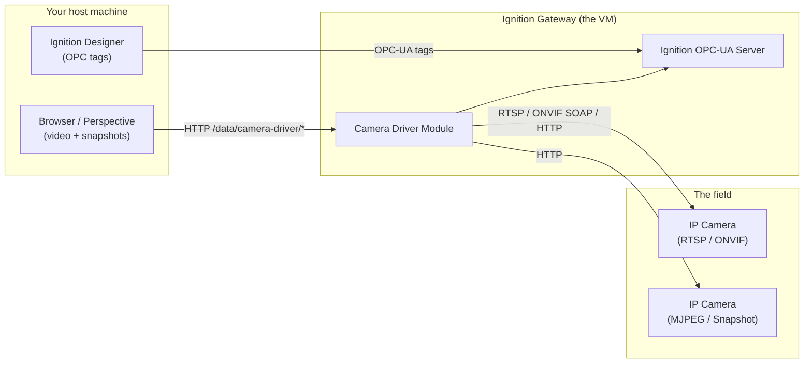
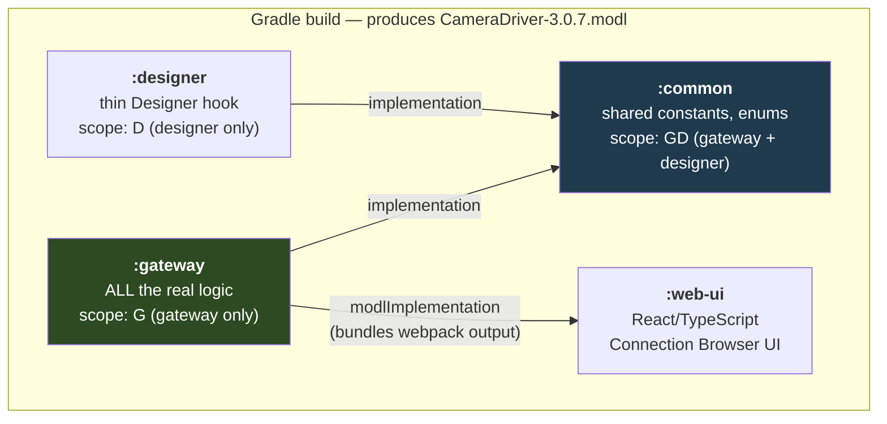
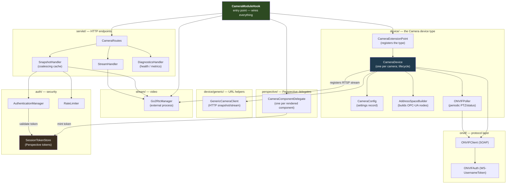
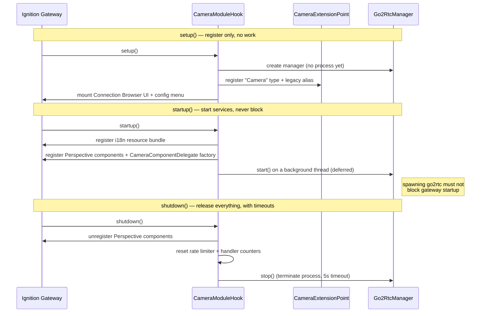
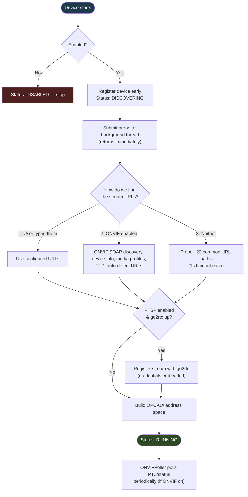
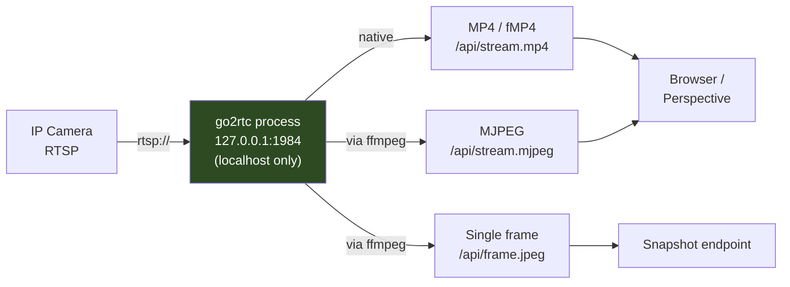
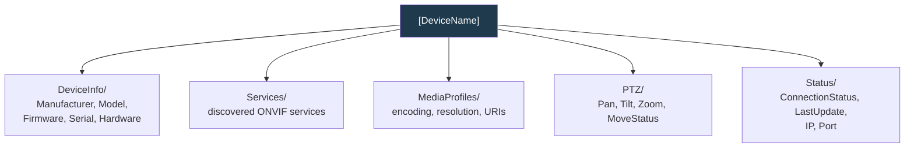
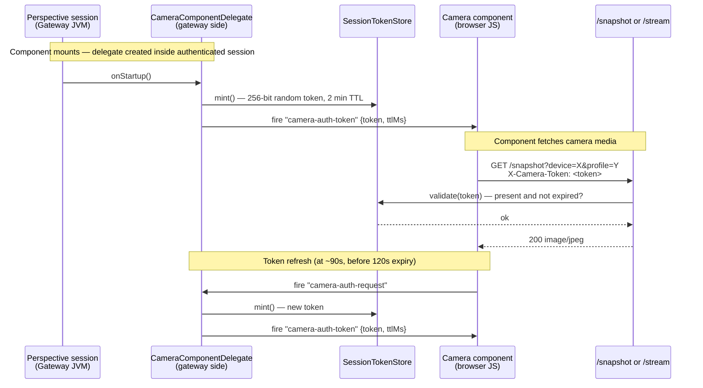

# Architecture

A visual, engineering-level guide to how the **Ignition Camera Driver** module is built, what it
does, and how the pieces fit together. Diagrams render automatically in VS Code (with a Mermaid
extension) and on GitHub.

> **Keep this current.** When you change a flow, update the matching diagram in the same commit.
> Each diagram is small and self-contained on purpose — you should rarely need to touch more than one.
> A maintenance checklist is at the [end of this document](#keeping-this-document-up-to-date).

**Module version:** 3.0.7 · **Module ID:** `com.gaskony.camera.opcua` · **Java 17 · Ignition SDK 8.3.0**

---

## 1. What it does (in one picture)

The module adds a single **"Camera"** device type to Ignition. You point it at an IP camera; it pulls
the camera's data into Ignition's **OPC-UA** server (so tags work like any other device) and serves
**live video / snapshots** to browsers through bundled streaming binaries.



**The two things it delivers:**
1. **OPC-UA tags** — device info, media profiles, PTZ status, connection status (browsable in Designer).
2. **Browser-friendly video** — RTSP cameras can't play in a browser directly, so the module
   transcodes them on the fly (see [§7](#7-streaming-pipeline-the-clever-bit)).

A camera can use **any combination** of four connection methods, toggled per device:

| Method | Protocol | What it gives you |
|--------|----------|-------------------|
| **ONVIF** | SOAP (Profile S/T) | Auto-discovery of stream URLs, media profiles, PTZ control, device info |
| **RTSP** | RTSP | Live video (transcoded to browser-playable formats) |
| **MJPEG** | HTTP MJPEG | Live video, played directly |
| **Snapshot** | HTTP | Single JPEG stills |

ONVIF is the "smart" one — enable it and it auto-detects the RTSP/snapshot URLs for the others. The
other three also work with URLs typed in by hand, no ONVIF needed.

---

## 2. Physical makeup — the four sub-projects

The module is a **Gradle multi-project build**. Each sub-project compiles to code that runs in a
different place inside Ignition. The `.modl` file you install is just a signed zip bundling them all
together with their dependencies and the streaming binaries.



**What each piece is and why it exists:**

| Sub-project | Size | Role |
|-------------|------|------|
| **`gateway/`** | Large — the module | Everything that matters: the device type, ONVIF client, HTTP endpoints, streaming manager, OPC-UA address space, Perspective component delegates. Runs on the Gateway. |
| **`common/`** | Tiny | Constants/enums shared by gateway + designer (the `GD` scope). One source of truth for route paths and IDs. |
| **`designer/`** | Tiny | A near-empty hook so the device type is recognised in the Designer. No real logic — the gateway does the work. |
| **`web-ui/`** | Medium | The **Connection Browser** React app shown in Gateway Config. Also contains the Perspective camera component frontend (Camera Viewer / Camera Grid). Webpack compiles it; the gateway bundles the output and serves it at `/res/camera-driver/*`. |

**Build wiring worth knowing** (so a UI change actually ships): the gateway's `processResources`
task depends on the web-ui webpack build, and the compiled JS lands in
`web-ui/build/generated-resources/`, which the gateway picks up into the `.modl`. The go2rtc and
ffmpeg binaries are downloaded at build time and bundled the same way (see [§7](#7-streaming-pipeline-the-clever-bit)).

```
ignition-module-camera-driver/
├── build.gradle.kts          # root build (defines scopes G/D/GD)
├── settings.gradle.kts       # lists the 4 sub-projects
├── common/                   # shared constants/enums
├── designer/                 # thin designer hook
├── gateway/                  # ← the whole module lives here
│   └── src/main/java/com/gaskony/camera/gateway/
│       ├── CameraModuleHook.java     # entry point (lifecycle)
│       ├── device/                   # the "Camera" device type
│       ├── onvif/                    # ONVIF SOAP protocol layer
│       ├── stream/                   # go2rtc + ffmpeg streaming
│       ├── servlet/                  # HTTP endpoints + handlers
│       ├── auth/                     # endpoint auth + session tokens
│       └── perspective/              # Perspective component delegates
└── web-ui/                   # React Connection Browser + Perspective components
```

---

## 3. Gateway internals — the component map

Everything below runs inside the Gateway JVM. This is the map to come back to when you've "lost track
of what's going on."



**The key players:**
- **`CameraModuleHook`** — the only entry point. Registers the device type, starts the streaming
  manager, mounts the HTTP routes and the config UI, registers Perspective component delegates.
- **`CameraDevice`** — one instance per configured camera. Owns that camera's connection, probing,
  and OPC-UA nodes. See [§5](#5-device-connection-flow).
- **`Go2RtcManager`** — wraps an external `go2rtc` process (+ ffmpeg) that does the RTSP transcoding.
- **`CameraRoutes` + handlers** — the `/data/camera-driver/*` HTTP API for browsers/Perspective.
- **`AuthenticationManager` + `RateLimiter`** — every HTTP request passes through these first.
- **`SessionTokenStore`** — short-lived 256-bit tokens for Perspective components (see [§11](#11-perspective-component-authentication)).
- **`CameraComponentDelegate`** — gateway-side delegate per rendered Perspective component; mints a token and fires it to the client on startup and on request.

---

## 4. Module lifecycle

Ignition calls three methods on `CameraModuleHook`, in order, over the module's life. The golden rule:
**`setup()` registers, `startup()` starts, `shutdown()` cleans up** — and nothing blocks.



**Why go2rtc starts on a background thread:** launching an external process + downloading binaries can
be slow. Doing it inline in `startup()` would stall the whole gateway boot, so it's submitted to a
daemon executor and the gateway carries on. If go2rtc fails to start, RTSP streaming degrades
gracefully to MJPEG/snapshot — the module still loads.

---

## 5. Device connection flow

What happens when a single Camera device starts. The important idea: **the device registers itself
immediately, then does all the slow network probing on a background thread** — so one unreachable
camera never freezes the gateway or the other cameras.



**URL discovery is a priority chain** — user-typed overrides win, then ONVIF auto-detection, then
brute-force probing of common camera URL paths, then a sensible RTSP default (`rtsp://IP:554/stream1`)
that go2rtc may still connect to even if the JVM's probe failed.

The four method toggles (RTSP/MJPEG/Snapshot/ONVIF) gate which branches run. They default to **on** so
that device configs created before the toggles existed still behave correctly.

---

## 6. Snapshot request flow

A browser or Perspective view asking for a JPEG still. This shows the **security gate**, the
**coalescing cache** that collapses duplicate concurrent requests, and the **fallback chain** used
to actually get an image.

```mermaid
sequenceDiagram
    participant B as Browser / Perspective
    participant H as SnapshotHandler
    participant A as AuthenticationManager
    participant R as RateLimiter
    participant Cache as Coalescing cache<br/>(in-flight + TTL)
    participant D as CameraDevice
    participant G2 as Go2RtcManager

    B->>H: GET /data/camera-driver/snapshot?device=X&profile=Y

    rect rgb(60,30,30)
    Note over H,R: Security gate (in order)
    H->>A: authenticated? (session / token / API key)
    A-->>H: ok / 401
    H->>R: under 600 req/min for this IP?
    R-->>H: ok / 429
    H->>H: under 50 concurrent snapshots? else 503
    end

    rect rgb(30,40,60)
    Note over H,Cache: Coalescing cache check
    H->>Cache: cached result for device+profile (4s TTL)?
    alt cache hit
        Cache-->>H: cached JPEG bytes
        H-->>B: 200 image/jpeg (from cache)
    else in-flight fetch exists
        Cache-->>H: join existing CompletableFuture
        Note right of H: wait for winner's result<br/>(no duplicate camera request)
    else no fetch in progress
        H->>Cache: register as winner (putIfAbsent)
    end
    end

    rect rgb(30,50,30)
    Note over H,G2: JPEG fallback chain (winner only — first that works wins)
    H->>D: 1. ONVIF snapshot (SOAP)?
    H->>D: 2. Generic HTTP snapshot URL?
    H->>G2: 3. go2rtc frame.jpeg (ffmpeg grabs a frame)?
    end

    H->>H: validate JPEG header (FF D8 FF), reject HTML
    H->>Cache: store result (4s TTL), resolve CompletableFuture
    H-->>B: 200 image/jpeg (raw bytes)
```



**Coalescing cache:** when multiple Perspective components display the same camera simultaneously,
all requests within the same 4-second window collapse into one. Only the "winner" (first to call
`putIfAbsent`) actually fetches from the camera; all other requests wait on the winner's
`CompletableFuture`. This avoids N×concurrent fetches for N components showing the same camera.

**The security gate is non-negotiable** — auth → rate limit → concurrency cap, every time. The
fallback chain means a snapshot works even for an RTSP-only camera (go2rtc grabs a frame via ffmpeg).
The final JPEG-header check stops a camera's HTML error page being served as if it were an image.

> **Note:** the rate limit is **600 requests/minute per IP** (deliberately high to support Perspective
> polling many cameras every few seconds).

---

## 7. Streaming pipeline (the clever bit)

Browsers **cannot play RTSP**. The module solves this by bundling **go2rtc** (a tiny streaming server)
and **ffmpeg** (a transcoder) inside the `.modl`. go2rtc runs as a local process and re-serves each
RTSP camera in formats a browser *can* play.



**How it fits together:**
- **Binaries are bundled, not installed.** go2rtc (v1.9.4) and ffmpeg are downloaded at *build* time,
  cached, and packed into the `.modl`. `Go2RtcManager` extracts them at runtime — nothing for the
  user to install.
- **go2rtc listens on `127.0.0.1:1984` only** — localhost-bound, so it's not exposed on the network;
  all external access goes through the authenticated `/data/camera-driver/*` endpoints.
- **Streams are registered dynamically.** When a Camera device finds its RTSP URL it calls
  `addStream(deviceName, url)`; go2rtc then serves that camera by name.
- **It self-heals.** A monitor thread restarts go2rtc up to 5 times with exponential backoff if the
  process dies.
- **Format choice:** MP4 is native (no ffmpeg needed); MJPEG and single-frame snapshots need ffmpeg.
  If ffmpeg/go2rtc are unavailable, the module falls back to the camera's direct MJPEG/snapshot URLs.

---

## 8. OPC-UA address space

When a camera connects (especially via ONVIF), its data is published as a tree of OPC-UA nodes that
appear in the Designer's OPC Browser like any other device.



`AddressSpaceBuilder` constructs these nodes. ONVIF cameras get the full tree above; cameras using
only direct URLs get a smaller `StreamInfo` + `Status` set.

---

## 9. Key facts (verified against source)

A quick-reference table of the numbers that actually matter. These are pulled from the code, not the
prose docs — if you change one in code, change it here too.

| Thing | Value |
|-------|-------|
| Module ID | `com.gaskony.camera.opcua` |
| Device type ID | `com.gaskony.camera.Camera` |
| Legacy alias type ID (pre-3.0 configs) | `com.onvif.driver.Camera` |
| go2rtc port (localhost only) | `127.0.0.1:1984` |
| go2rtc version | 1.9.4 |
| HTTP rate limit | 600 req/min per IP |
| Max concurrent snapshots | 50 |
| Snapshot coalescing TTL | 4 seconds |
| Session token TTL | 120 seconds (2 min) |
| Auth lockout | 5 failures → 15 min lockout |
| Per-path probe timeout | 1000 ms |
| RTSP default port | 554 |
| go2rtc auto-restart | 5 attempts, exponential backoff |
| Java / Ignition SDK | 17 / 8.3.0 |

---

## 10. The HTTP API surface

All endpoints are under `/data/camera-driver/*`. Most pass the [§6 security gate](#6-snapshot-request-flow).

| Endpoint | Auth | Purpose |
| -------- | ---- | ------- |
| `GET /snapshot?device=X&profile=Y` | Required | One JPEG still |
| `GET /stream?device=X&profile=Y&fps=Z` | Required | Live MJPEG stream |
| `GET /devices` | Required | List all configured cameras + status |
| `GET /device/:name/status` | Required | One camera's status |
| `GET /ptz/status?device=X&profile=Y` | Required | Current PTZ position |
| `POST /ptz/move` | Required | PTZ absolute move |
| `POST /ptz/stop` | Required | PTZ stop |
| `GET /health` | Required | Module health + JVM heap stats |
| `GET /metrics` | Required | Per-camera resource metrics (viewers, bitrate, snapshot latency) |
| `GET /diagnostics` | Required | Full internal diagnostics (go2rtc, threads, streaming) |
| `GET /auth-status` | Open | `{"authenticated": true/false}` — safe to poll unauthenticated |
| `GET /logs/gateway` | Required | Recent gateway log lines |
| `GET /connection-browser` | Open | The React Connection Browser UI |
| `GET /player` | Open | Embeddable Perspective video player |
| `GET /mse-player.js` | Open | MSE player JavaScript bundle |

---

## 11. Perspective component authentication

Perspective views run in the browser but their `fetch()` calls carry no Gateway WebUI session cookie
— they would always receive `401` from the normal auth gate. The module solves this with a
**session-token handshake** that requires no API key and no user configuration.



**Why this is secure:** a `CameraComponentDelegate` instance exists only while a rendered component
lives in a real authenticated Perspective session. Issuing the token IS the authorisation check —
the session's existence is the proof. Tokens are 256-bit cryptographically random, expire after
2 minutes, and are stored only in JVM memory (never persisted). No credentials leave the server.

---

## 12. The `/metrics` endpoint — per-camera resource view

The `/metrics` endpoint gives a Frigate-style view of what each camera is consuming right now.
It powers the **Camera Resources** table on the Dashboard and is designed for operational visibility
into a memory-intensive module.

```json
{
  "jvm":    { "heapUsedMb": 38, "heapMaxMb": 512, "heapPercent": 7 },
  "go2rtc": { "alive": true, "processMemoryMb": 62, "processMemoryKb": 63488 },
  "cameras": {
    "FrontDoor": {
      "go2rtcConsumers":    2,
      "go2rtcBitrateKbps":  1240,
      "go2rtcProducerState": "online",
      "go2rtcProducerTracks": ["video/H264", "audio/PCMA"],
      "snapshotLastDurationMs": 83,
      "snapshotLastTimestampMs": 1750540000000,
      "snapshotTotalFetches": 47,
      "snapshotErrors": 0,
      "status": "RUNNING",
      "onvifAvailable": true,
      "go2rtcRegistered": true
    }
  },
  "timestamp": 1750540001234
}
```

Data sources:

- **JVM heap** — `MemoryMXBean.getHeapMemoryUsage()` (module-relevant, not system RAM).
- **go2rtc RSS** — read from `/proc/<pid>/status` by `Go2RtcManager.getProcessInfo()`.
- **go2rtc per-stream** — `Go2RtcManager.getStreamsByName()` calls go2rtc's `/api/streams` API.
- **Snapshot stats** — static maps in `SnapshotHandler` recording fetch duration, timestamp, totals, and error counts per device.

---

## Keeping this document up to date

This doc is meant to live alongside the code. When you make a change, update the matching section in
the **same commit**:

| If you change… | Update |
|----------------|--------|
| `CameraModuleHook` lifecycle | [§4](#4-module-lifecycle) |
| `CameraDevice` startup / probing | [§5](#5-device-connection-flow) |
| HTTP endpoints / handlers / auth | [§6](#6-snapshot-request-flow), [§10](#10-the-http-api-surface) |
| `Go2RtcManager` / streaming | [§7](#7-streaming-pipeline-the-clever-bit) |
| OPC-UA nodes (`AddressSpaceBuilder`) | [§8](#8-opc-ua-address-space) |
| Any of the numbers (ports, limits, versions) | [§9](#9-key-facts-verified-against-source) |
| Sub-projects / build wiring | [§2](#2-physical-makeup--the-four-sub-projects) |
| Session token / Perspective auth | [§11](#11-perspective-component-authentication) |
| `/metrics` endpoint or Dashboard | [§12](#12-the-metrics-endpoint--per-camera-resource-view) |

**Rule of thumb:** if a diagram would now mislead a new reader, it's out of date — fix it. Diagrams are
deliberately small so this is a one-minute edit, not a rewrite.

---

*Last updated 2026-06-22 from source at module version 3.0.7.*
